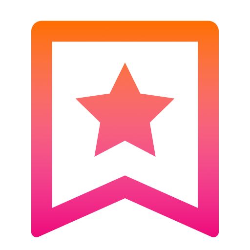

<div align="center">
  <header>
    
    <h1>Quick Read</h1>
    <p>Ad free light version of article inside Slack</p>
  </header>
</div>


<!-- ALL-CONTRIBUTORS-BADGE:START - Do not remove or modify this section -->

[](#contributors-)

<!-- ALL-CONTRIBUTORS-BADGE:END -->

## Contributing

Runs on [NodeJS](https://nodejs.org/)

Libraries:

- [Slack Bolt](https://slack.dev/bolt-js/concepts) framework
- [Postlight Mercury Parser](https://github.com/postlight/mercury-parser)
- [FaunaDB](https://fauna.com/)

Package management with [npm](https://www.npmjs.com/)

```
npm install
npm run dev
```

If you like to test out on your Slack workspace, follow steps outlined on [Bolt Getting Started page](https://slack.dev/bolt-js/tutorial/getting-started) in context of this workspace.

Raise an [issue](https://github.com/agneym/quick-read-slack) for bugs/queries.

## Contributors

This project follows [all contributors](https://allcontributors.org/) specification. All contributions are welcome.

<!-- ALL-CONTRIBUTORS-LIST:START - Do not remove or modify this section -->
<!-- prettier-ignore-start -->
<!-- markdownlint-disable -->
<table>
  <tr>
    <td align="center"><a href="https://blog.agney.dev"><br /><sub><b>Agney Menon</b></sub></a><br /><a href="https://github.com/agneym/quick-read-slack/commits?author=agneym" title="Code">💻</a> <a href="#ideas-agneym" title="Ideas, Planning, & Feedback">🤔</a></td>
  </tr>
</table>

<!-- markdownlint-enable -->
<!-- prettier-ignore-end -->

<!-- ALL-CONTRIBUTORS-LIST:END -->
