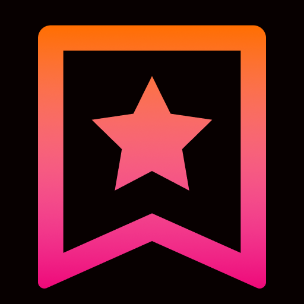

<div align="center">
  <header>
    
    <h1>Quick Read</h1>
    <p>Ad free light version of article inside Slack</p>
  </header>
</div>

## Contributing

Runs on [NodeJS](https://nodejs.org/)

Libraries:

- [Slack Bolt](https://slack.dev/bolt-js/concepts) framework
- [Postlight Mercury Parser](https://github.com/postlight/mercury-parser)

Package management with [npm](https://www.npmjs.com/)

```
npm install
npm start
```

If you like to test out on your Slack workspace, follow steps outlined on [Bolt Getting Started page](https://slack.dev/bolt-js/tutorial/getting-started) in context of this workspace.

Raise an [issue](https://github.com/agneym/quick-read-slack) for bugs/queries.

## Contributors

This project follows [all contributors](https://allcontributors.org/) specification. All contributions are welcome.
